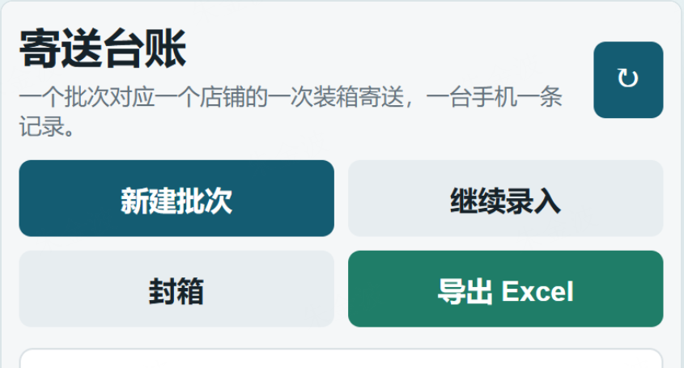
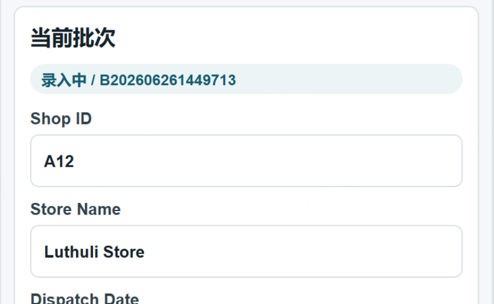
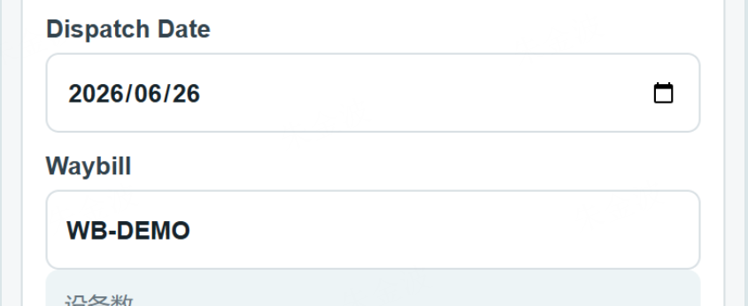

# Phone Dispatch / 寄送台账 App

Phone Dispatch is a lightweight Android app for used-phone trade-in dispatch work. It helps store staff record devices, scan or recognize IMEI, create dispatch batches, export a standard Excel file, and share the file through WhatsApp, Feishu, email, or other mobile channels.

这是一个面向以旧换新门店的手机端寄送台账工具。门店即使没有电脑，也可以直接在手机上完成旧机录入、IMEI 扫码或拍照识别、寄送批次整理、标准 Excel 导出，并通过 WhatsApp、飞书等渠道分享给后台人员统一收集。

## Links

- Download page / 下载页: https://gold-wave.github.io/dispatch-ledger-apk/
- Latest APK / 最新安装包: https://gold-wave.github.io/dispatch-ledger-apk/dispatch-ledger-latest.apk
- Repository / GitHub 仓库: https://github.com/gold-wave/dispatch-ledger-apk

## Latest Version

- Version: `v16 / 1.0.15`
- Latest APK: `dispatch-ledger-latest.apk`
- Versioned APK: `dispatch-ledger-v16.apk`
- SHA256: `3C36138A11E297CD8E3F5E729640CEB7E70E1AFBA03EC771C264B7CDF999A319`

## Why This App

In trade-in operations, stores often need to send batches of used phones to a warehouse or processing team. The original process usually depends on Excel, but many stores do not have a computer or cannot conveniently maintain spreadsheets.

This app turns the store-side workflow into a mobile process:

1. Record store and sender information.
2. Add stock devices on the phone.
3. Scan or recognize IMEI1 from camera or gallery.
4. Create a dispatch batch.
5. Add selected devices to the current dispatch.
6. Export a standardized Excel workbook.
7. Share the Excel file directly through WhatsApp, Feishu, email, or other mobile apps.

## Screenshots

| Main actions | Store and batch info | Date and waybill |
| --- | --- | --- |
|  |  |  |

## Key Features

- Mobile-first data entry for stores without computers.
- Local offline storage on the Android phone.
- Store profile and sender profile saved for repeated use.
- Full 15-digit IMEI validation.
- IMEI camera scan and photo recognition.
- Duplicate IMEI prevention.
- Dispatch method support: courier or self handover.
- Courier waybill required before export.
- Standard Excel export for backend collection.
- Direct sharing to WhatsApp, WhatsApp Business, Feishu, email, and other apps.
- Re-share exported dispatch files when needed.

## Business Value

- Lower store operation barrier: no computer required.
- Reduce manual Excel mistakes.
- Standardize store-side data format.
- Make IMEI, batch, waybill, and price checks easier.
- Help backend teams merge, verify, and archive store submissions.

## Typical Store Workflow

1. Install the APK on an Android phone.
2. Open the app and fill in `Shop ID` and `Store Name`.
3. Fill in sender name and sender phone.
4. Add each used phone to stock.
5. Use camera scan or photo recognition for IMEI1 when possible.
6. Create a dispatch batch.
7. Select dispatch method and fill in waybill if using courier.
8. Add devices to the current dispatch.
9. Export and share the Excel file to the target WhatsApp or Feishu group.

## Notes

- Updating the APK normally keeps local SQLite data.
- Uninstalling the app or clearing app data removes local records.
- Stores should export and share the Excel file after each dispatch.
- If an exported file is wrong, create a corrected export and clearly tell the group to use the latest file.

## AI Practice Summary

This project is also an AI practice example. It uses AI-assisted product thinking and development to turn a real store operation pain point into a working mobile tool: from process clarification, prototype iteration, Android implementation, Excel export, documentation, and GitHub Pages publishing.

The result is a practical workflow improvement: stores enter cleaner data, backend teams receive more consistent Excel files, and later IMEI checking, batch merging, and reconciliation become easier.
